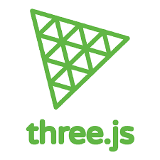
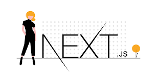
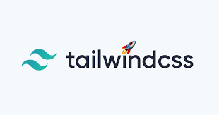
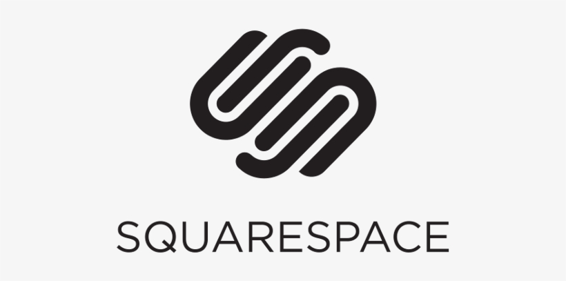
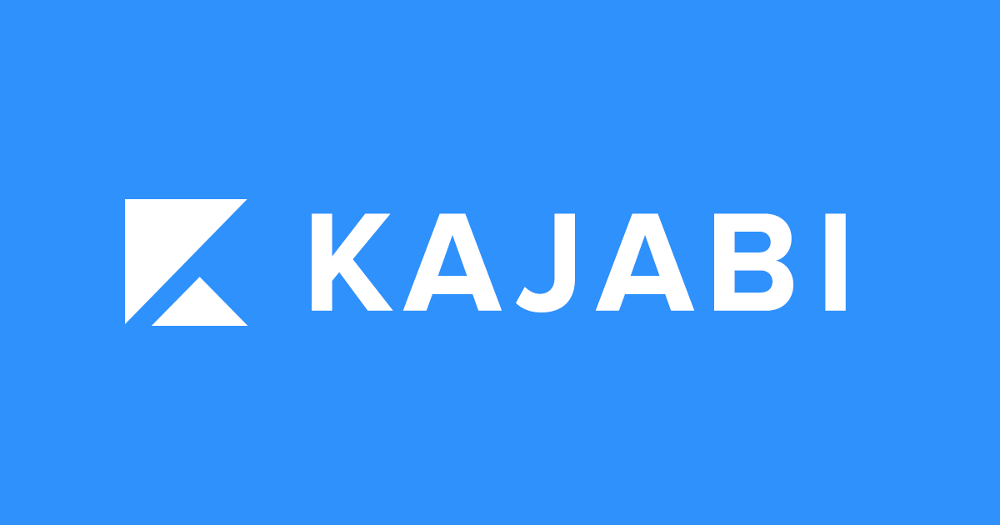

# Welcome to DevNinja's Git! 
<!-- <a target="blank" href="https://profile-counter.glitch.me/happycodinglover/count.svg">
❤ Visitor Counts ❤   </a> -->

## Hi all, I am Dev Ninja
I am a senior full-stack developer with 4+ years of hands-on experience.
My main stack is MERN and have more than 3+ years of strong experience in MERN development.
I have worked in serveral companies as a remote developer.
I am good at javascript/typescript, html, css, tailwindcss and I am very familiar with frameworks such as React/Redux, Next.js, Node.js, Express.js and etc.
Also I am familiar with Git, Monday, Trello.
I am convinced of my skills, experience, communication, and team work ability.
I am always ready to talk with you about a new opportunity, and I can start working in a remote position immediately.
Please DM me any time you want.
 
## My Skills

|  Front-end   | Back-end   |  Full Stack   | Database   |
| ----------- | ----------- | ----------- | ----------- |
|       |       |        |        |

## About me
* I am an entrepreneurial software engineer heavily focusing on web development as a Full-stack.
* My focus is to help clients with their business by fixing and creating projects of value.
* I have experience working as an individual developer and a project manager in many projects providing me with the skills of communicating with clients to satisfy their needs.
* My experience tells everybody who I am, what I can do for your project.

* A day in my life may consist of: prepping web art, fixing some front-end bugs, adding an API endpoint, dockerizing an application, database design, configuring a unit or UI test library, setting up a build or deployment plan, provisioning a test tier machine or feature work when I am lucky.

## Thank You For Your Time
